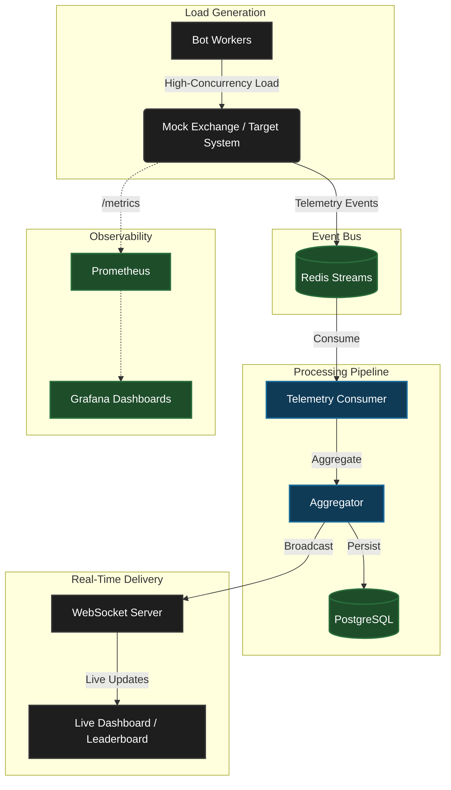

# ⚡ BenchForge

> A production-grade, distributed benchmarking and telemetry infrastructure platform designed for high-concurrency performance testing, real-time observability, and scalable systems experimentation.

[](https://opensource.org/licenses/MIT)
[](https://golang.org/)
[](https://www.docker.com/)

---

## 📖 Project Overview

**BenchForge** is a cutting-edge distributed load generation and telemetry pipeline built to push trading systems and distributed architectures to their absolute limits. By simulating immense concurrent traffic and capturing microsecond-level telemetry, BenchForge provides unparalleled insights into system performance, latency distributions, and correctness under extreme load. 

It is engineered with a **Golang microservices architecture**, utilizing **Redis Streams** for event-driven decoupled messaging, and **PostgreSQL** for durable metrics persistence.

## 🚀 Why BenchForge Exists

Modern trading systems and distributed backends require rigorous validation before production deployment. Simple HTTP pingers fall short. BenchForge exists to provide a **comprehensive, high-fidelity benchmarking ecosystem**. It not only bombards a target system with mathematically modeled workloads but also collects, aggregates, and visualizes system reactions in real-time.

## ✨ Key Features

BenchForge is designed to simulate, measure, and observe.

| Capability | Description |
|---|---|
| **Distributed Benchmark Engine** | Scalable worker pools capable of generating massive concurrent TCP/HTTP loads with microsecond precision. |
| **Trading Personas** | Configurable bot behaviors (Retail, HFT, Whale, Panic Seller) simulating real-world market dynamics. |
| **Telemetry Analytics Pipeline** | High-throughput ingestion of metric events using Redis Streams, decoupled from the load generation path. |
| **Replay Engine** | Deterministic event sourcing allowing pixel-perfect replay of market scenarios and system state. |
| **Live Leaderboard** | Real-time WebSocket-powered scoring updates for competitive algorithmic evaluation. |
| **Observability Stack** | Native integration with Prometheus, Grafana, and structured JSON logging. |
| **Admin Dashboard** | Centralized control plane for orchestrating benchmark runs and analyzing telemetry. |
| **Containerized Deployment** | Fully Dockerized services ensuring reproducible environments across local and production clusters. |

---

## 🏛️ Architecture Overview

BenchForge follows an asynchronous, event-driven architecture designed to minimize overhead during intense load generation while maximizing observability.



### System Highlights

- **Event-Driven Resilience**: Redis Streams buffers traffic bursts, preventing telemetry processing from impacting the critical load generation path.
- **Graceful Orchestration**: Comprehensive Context-based OS signal handling ensures zero-data-loss shutdowns across goroutines, consumer groups, and connection pools.
- **Microsecond Observability**: Built-in native support for Prometheus metrics tracking latency percentiles, throughput, and system health.

---

## 🔬 Core Subsystems

### 🤖 Trading Personas
The load generator isn't a simple loop. It utilizes sophisticated **goroutine worker pools** that mimic complex market participant behaviors:
- **Retail Trader**: Small, randomized orders with organic jitter.
- **HFT Bot**: Ultra-low-latency, high-frequency request bursts.
- **Whale Bot**: Massive volume orders testing market depth and liquidity engines.
- **Panic Seller**: Sudden, overwhelming sell pressure to test system backpressure handling.

### 📼 Replay Engine
Every event is captured deterministically. The Replay Engine leverages bucket aggregation and insight detection to allow developers to step through a benchmark run post-mortem, reconstructing the exact sequence of events that led to a bottleneck or failure.

### 🏆 Scoring Engine & Leaderboard
For hackathons and competitive evaluations, BenchForge incorporates a rigorous scoring engine evaluating correctness (FIFO compliance, price-time priority) and raw throughput (TPS). Results are broadcasted live via WebSockets to a dynamic Leaderboard.

---

## 🛠️ Technology Stack

**Backend Services:** Go (Golang), Gin Framework  
**Event Streaming:** Redis Streams  
**Data Persistence:** PostgreSQL 17  
**Real-Time Comms:** WebSockets  
**Observability:** Prometheus, Grafana, cAdvisor, Structured Logging (slog)  
**Infrastructure:** Docker, Docker Compose  

---

## ⚡ Quick Start

### 1. Clone the Repository
```bash
git clone https://github.com/RohitChavan16/IICPC_BenchForge.git
cd IICPC_BenchForge
```

### 2. Environment Setup
Each microservice requires environment variables. Copy the provided template:
```bash
cp .env.example .env
# Optional: customize .env for your specific deployment needs
```
*(See [Environment Guide](./docs/environment.md) for detailed variable documentation).*

### 3. Running Services
Deploy the entire stack with Docker Compose:
```bash
docker compose up --build -d
```
The following core services will boot:
- **API Gateway:** `http://localhost:8080`
- **Telemetry Service:** `http://localhost:8081`
- **Prometheus:** `http://localhost:9090`
- **Grafana:** `http://localhost:3000`

---

## 📸 Screenshots

*A visual tour of the BenchForge platform.*

| Dashboard | Replay Engine |
|---|---|
|  |  |

| Live Leaderboard | Infrastructure Monitoring |
|---|---|
|  |  |

---

## 📂 Repository Structure

A clean, modular monolith structured for microservices:

```text
IICPC_BenchForge/
├── frontend/             # Next.js/React based web portals (Leaderboard, Admin)
├── services/             # Independent Go microservices
│   ├── api-gateway/      # Unified REST API routing
│   ├── bot-worker/       # Concurrent load generation engine
│   ├── telemetry-service/# Redis Stream consumption & aggregation
│   ├── mock-exchange/    # Reference implementation of a target system
│   ├── benchmark-service/# Orchestrates benchmark lifecycles
│   └── ...               
├── deployments/          # Prometheus configs, Grafana provisioning
├── docs/                 # Architectural deep-dives and specifications
└── scripts/              # Helper utilities for DB migrations and local dev
```

---

## 📚 Documentation Links

Deep dive into the BenchForge internals:

- [Architecture Design](./docs/architecture.md)
- [Benchmark Lifecycle & Engine](./docs/benchmarking.md)
- [Telemetry Pipeline](./docs/telemetry.md)
- [Replay Engine Internals](./docs/replay-engine.md)
- [API Overview](./docs/api-overview.md)
- [Deployment & Operations](./docs/deployment.md)

---

## 🤝 Contribution Guide

We welcome contributions from distributed systems engineers, backend developers, and trading enthusiasts. Please review our [Contribution Guidelines](./CONTRIBUTING.md) to understand our coding standards, branch strategies, and PR processes.

---

## 🛣️ Roadmap

BenchForge is actively evolving. Our Future Roadmap focuses on pushing the boundaries of distributed testing:

- **Multi-Contest Support:** Orchestrate multiple simultaneous benchmarking competitions.
- **Advanced Replay Analytics:** ML-based bottleneck detection and anomaly highlighting.
- **Distributed Benchmark Workers:** Scale load generation horizontally across Kubernetes clusters.
- **Historical Analytics:** Petabyte-scale warehousing for long-term trend analysis.

*For detailed milestones, see [Roadmap](./docs/roadmap.md).*

---

## 📄 License

This project is licensed under the **MIT License**. See the [LICENSE](./LICENSE) file for details.

## 🙏 Acknowledgements

Built for the extreme demands of the IICPC Hackathon and engineered to advance the standard of open-source benchmarking tools. Special thanks to the Go community and the maintainers of Redis and PostgreSQL.