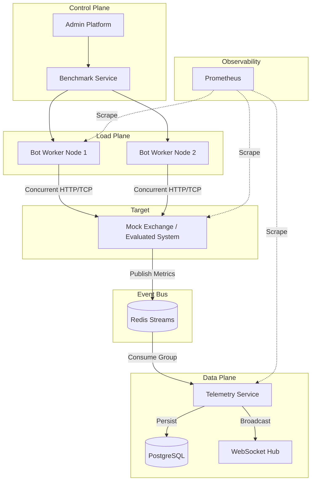
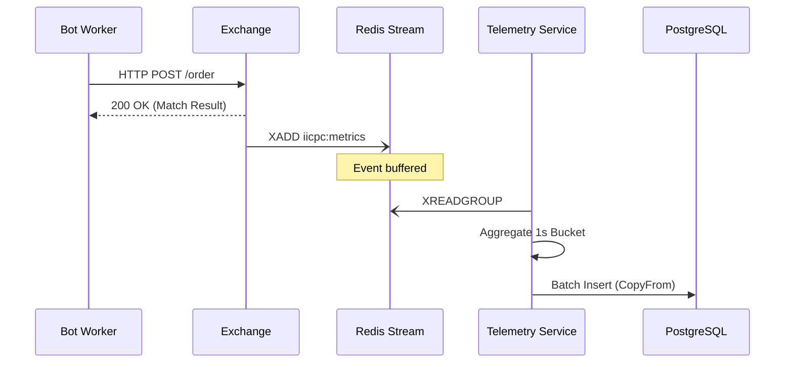

# System Architecture

## System Overview

BenchForge is architected as an event-driven, distributed microservices platform. It separates the highly volatile load generation plane from the telemetry ingestion and observability planes, ensuring that telemetry collection does not introduce observer effect (latency) to the systems under test.

## Microservices

The system is decoupled into isolated, independently scalable services written in Go.

- **API Gateway**: Unified routing layer managing authentication and proxying requests.
- **Bot Worker**: The core load generation engine. Uses highly optimized, lock-free Goroutine pools to bombard the target exchange.
- **Telemetry Service**: Ingests, aggregates, and flushes metrics from Redis to PostgreSQL.
- **Mock Exchange**: A reference implementation of a trading engine for testing baseline throughput.
- **Benchmark Service**: Orchestrates the lifecycle of a benchmark (Init, Start, Stop, Report).
- **Leaderboard Service**: Manages WebSocket connections and streams live ranking data.
- **Submission Service**: Handles user code uploads and compilation triggers.
- **Deployment Service**: Manages dynamic port allocation, Docker bridge networks, and contestant engine execution.
- **Container Runner**: Responsible for safely isolating and building contestant Dockerfiles.

## Databases

### Redis
Used as the primary **Event Bus** and **In-Memory Cache**.
- **Redis Streams**: Provides durable, append-only logs for telemetry events. Prevents data loss during burst traffic via Consumer Groups.
- **Pub/Sub**: Used for signaling low-latency commands (e.g., immediate abort of a running benchmark).

### PostgreSQL
Serves as the **Persistent Source of Truth**.
- Stores historical benchmark runs, aggregated percentiles (P50, P90, P99), system metadata, and user submissions.

## WebSockets

Real-time capabilities are driven by WebSockets originating from the Leaderboard and Telemetry services.
- Delivers sub-second updates to the frontend for live leaderboards.
- Streams live logs and TPS graphs to the Admin Dashboard.

## Replay Engine

The architecture natively supports event sourcing via the telemetry stream. By capturing every order state change, the Replay Engine can reconstruct the exact market conditions and order book state at any millisecond during a benchmark.

## Telemetry Pipeline

## Scoring Pipeline

Triggered post-benchmark. It evaluates the raw throughput (from PostgreSQL buckets) against the correctness matrix generated during the validation phase to calculate a final normalized score.

## Leaderboard Pipeline

Listens to PostgreSQL trigger events or Redis Pub/Sub channels to update the cached rankings, immediately pushing deltas over WebSockets to all connected clients.

## Admin Platform

A centralized control plane providing:
- Cluster health monitoring.
- Granular control over worker nodes.
- Deep-dive analytics into anomaly detection during specific runs.

## Future Extensibility

- **Kubernetes Operator**: Moving from Docker Compose to native K8s orchestration to horizontally auto-scale Bot Workers across physical nodes.
- **Kafka Migration Path**: Interfaces are designed to allow swapping Redis Streams for Apache Kafka if throughput exceeds memory bounds.