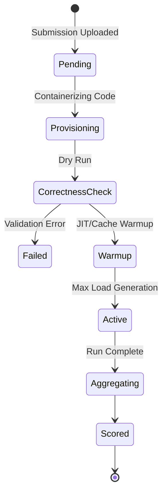

# Benchmarking Engine

The BenchForge benchmarking engine is the core load-generation component, designed to push distributed systems to their absolute limits using coordinated Goroutine swarms.

## Benchmark Lifecycle

Every benchmark run follows a strict, deterministic lifecycle to ensure reproducibility.



1. **Initialization**: The system spins up an isolated container of the contestant's trading engine.
2. **Correctness Phase**: Slow, sequential orders are sent to verify FIFO logic, price-time priority, and partial fill accuracy.
3. **Warmup**: A burst of traffic is sent to ensure TCP connections are established and language runtimes (like JVMs or V8) have JIT-compiled critical paths.
4. **Execution (Active)**: The floodgates open. Workers generate maximum configured concurrent traffic.
5. **Cooldown & Aggregation**: Load stops. The system waits for Redis Streams to drain and telemetry to aggregate.

## Trading Personas

To simulate a realistic exchange environment, the benchmark engine utilizes multiple specialized bot personas rather than a uniform distribution of requests.

- **Retail Trader**: 
  - Simulates individual users.
  - Submits small quantity orders (1-100 units).
  - High variance in latency and order frequency.
- **HFT Bot**: 
  - Simulates High-Frequency Trading algorithms.
  - Submits massive bursts of limit orders and rapid cancellations.
  - Tests the target's ability to handle high connection churn and lock contention.
- **Whale Bot**: 
  - Submits orders capable of wiping out entire price levels in the order book.
  - Tests the target's liquidity sweep algorithms and memory allocation during large data mutations.
- **Panic Seller**: 
  - Simulates market crashes.
  - Triggers massive, simultaneous market sell orders.
  - Tests backpressure, circuit breakers, and queue saturation.

## Scoring Formula

Scores are not purely based on raw Requests Per Second (RPS). 

```text
Final Score = (Throughput Multiplier) * (Correctness Penalty) * (Latency Degradation Factor)
```

- **Throughput**: Calculated based on the 95th percentile of successful matches per second.
- **Correctness**: Any invalid match or FIFO violation reduces the multiplier. Extreme violations result in an immediate `0`.
- **Latency Factor**: Systems that maintain consistent latency at high load score better than systems that exhibit massive latency spikes under pressure.

## Telemetry Collection

During load generation, the Bot Workers measure the exact round-trip time (RTT) for every request. This is collected entirely in-memory using lock-free data structures and flushed asynchronously to Redis Streams to ensure measuring latency does not *cause* latency.

## Replay Generation

Once the benchmark finishes, the telemetry stream is serialized into a deterministic JSON sequence. This allows developers to step through the entire event stream, evaluating exactly when their system's latency spiked or where a deadlock occurred.

## Leaderboard Updates

Once the Scoring Formula concludes, the resulting score is persisted to PostgreSQL, and an invalidation event is pushed via Redis Pub/Sub, causing the Leaderboard Service to broadcast the updated standings.
