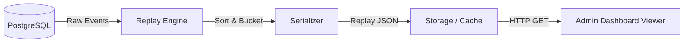

# Replay Engine Internals

The BenchForge Replay Engine is a powerful tool designed for post-mortem analysis of distributed system behavior under extreme load. It allows developers to step backward and forward through a benchmark run with millisecond precision.

## Replay Generation

During a live benchmark, it is impossible to stream full event state to a frontend without crashing the network layer. Instead, the telemetry pipeline asynchronously logs every fundamental state change to the database. 

Once the benchmark transitions to the `Aggregating` state, the Replay Engine kicks in. It queries the massive dataset of executed orders, sorts them deterministically by timestamp, and serializes them into a highly optimized Replay JSON format.

## Bucket Aggregation

To ensure the frontend Replay Viewer does not crash when attempting to render a million orders, the Replay Engine uses **Bucket Aggregation**.

1. The total benchmark duration is divided into temporal buckets (e.g., 1-second or 100-millisecond windows).
2. Within each bucket, the engine aggregates total orders, successful trades, and latency percentiles.
3. The frontend retrieves these buckets sequentially, rather than downloading a monolithic file.

## Insight Detection

While generating buckets, the Replay Engine runs heuristic algorithms to identify anomalies:
- **Throughput Drops**: Sudden drops in matching volume relative to the incoming load.
- **Latency Spikes**: Sustained periods where P99 latency exceeds predefined thresholds.
- **Order Book Imbalances**: Scenarios where one side of the mock exchange order book becomes significantly deeper than the other, often indicating a bug in the matching engine's sweep logic.

These insights are embedded directly into the Replay JSON, allowing the UI to flag critical moments for the user to review.

## Playback Architecture



## Replay JSON Structure

The output generated for the frontend is structured to minimize parsing overhead while retaining deep granularity.

```json
{
  "benchmark_id": "uuid-v4",
  "total_duration_ms": 60000,
  "insights": [
    {
      "type": "latency_spike",
      "timestamp_ms": 14500,
      "description": "P99 Latency exceeded 500ms"
    }
  ],
  "timeline": [
    {
      "bucket_start_ms": 0,
      "bucket_end_ms": 1000,
      "events": [
        {
          "event_type": "ORDER_PLACED",
          "bot_id": "hft-01",
          "latency_us": 450,
          "status": "FILLED"
        }
      ],
      "metrics": {
        "tps": 1240,
        "p90_latency_us": 400
      }
    }
  ]
}
```
