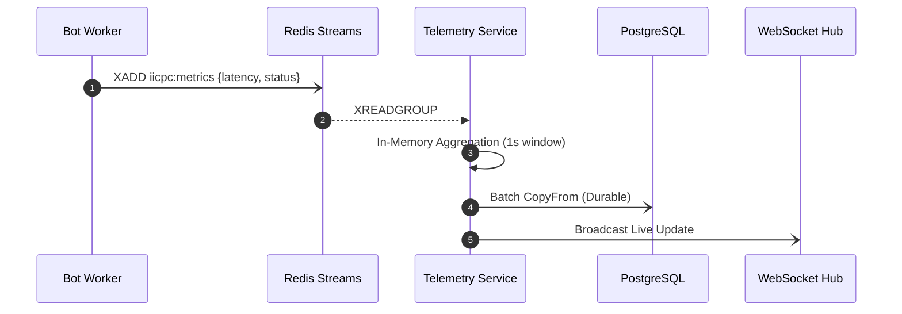

# Telemetry Pipeline

The telemetry pipeline is the nervous system of BenchForge. It is responsible for ingesting, processing, and broadcasting millions of data points per minute without introducing latency into the core benchmarking path.

## Telemetry Flow

The entire flow is designed around the principle of asynchronous decoupling.

## Metrics Tracked

The pipeline captures highly granular telemetry for every simulated order:
- **End-to-End Latency**: Measured in microseconds (µs), tracking the time from TCP packet dispatch to the receipt of the HTTP response.
- **Status Codes**: Tracking HTTP 200s, 400s, 500s, and TCP timeouts.
- **Error Distribution**: Categorizing failure types (e.g., connection reset, rate limited).
- **Concurrency Levels**: Active Goroutines and open file descriptors during the burst.

## Redis Streams

We utilize **Redis Streams** over traditional Pub/Sub or list queues because it offers:
1. **Durability**: Events are persisted in memory and won't be lost if the telemetry service temporarily crashes.
2. **Consumer Groups**: Enables horizontal scaling of the Telemetry Service. Multiple instances can consume from the same stream without processing duplicate events.
3. **High Throughput**: Capable of ingesting hundreds of thousands of small JSON/MsgPack payloads per second.

## Aggregation

The Telemetry Service acts as an accumulator. It reads a firehose of events from Redis but does not perform a database insert for every event.
- It maintains lock-free counters in memory.
- Every 1,000ms (1 second), it calculates the throughput (TPS) and latency percentiles (P50, P90, P95, P99).
- These aggregated "windows" are then flushed to PostgreSQL in a single batch transaction.

## Analytics

By querying the PostgreSQL aggregated buckets, the Admin Platform provides:
- Historical trend analysis across different versions of a contestant's submission.
- Moving averages to smooth out network jitter visualization.
- Anomaly detection based on standard deviation variance.

## WebSockets

Real-time feedback is crucial during a live benchmark. 
The WebSocket Hub subscribes to the 1-second aggregation ticks and pushes JSON payloads directly to connected frontend clients, powering the live charts and dynamic Leaderboard.
